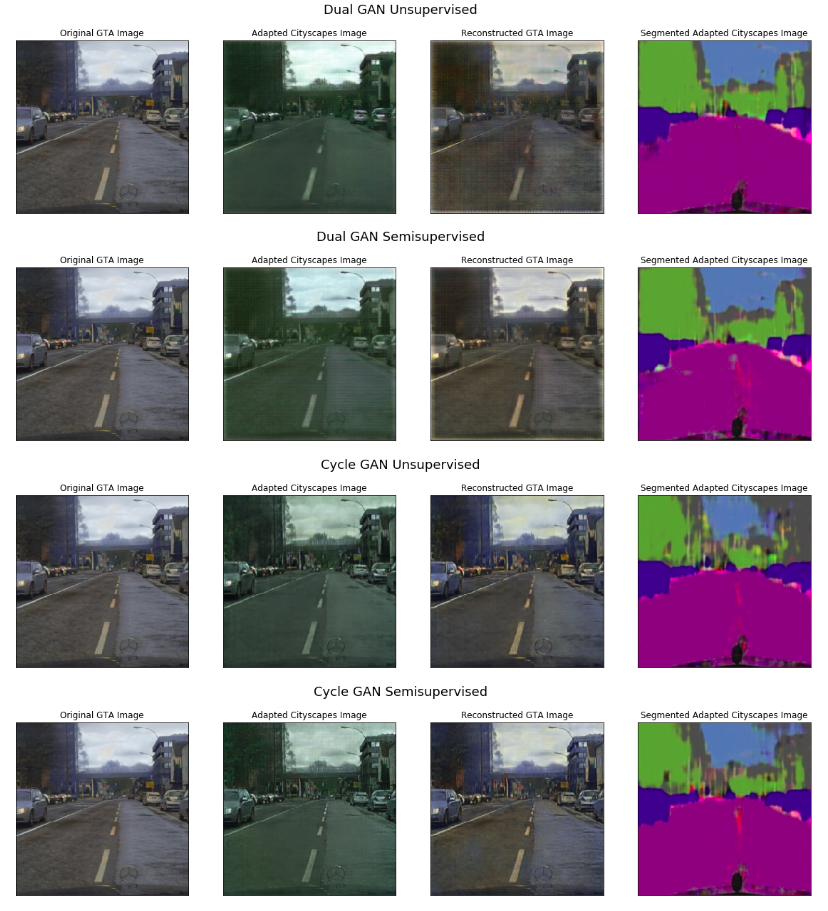

# GTA-Domain-Adaptation

We study the problem of domain adaptation between GTA and cityscapes datasets. <br>
This was done as part of the group project for ECE 285 (ML for Image Processing) course at UCSD. <br>
*Contributors: Manjot Singh Bilkhu, Anurag Paul, Tushar Dobhal, Harshul Gupta and Sreekrishna Ramaswamy.*

# Getting Started
### Dependencies
- Install python3 and pytorch.
- install other requirements using 

```
pip install -r requirements.txt
```

### Dataset
Download the dataset by running 
```
bash ./get_dataset.sh
```
This will place the dataset in a foder named 'dataset' in the root directory.

# Pretrained Models
Download pretrained models using
``` 
bash ./get_pretrained_models.sh
```
This will create a folder named models and will download pre-trained models which will be used by the test and demo notebooks.

# Description
```
cycle_gan.py : Contains the class which implements the CycleGAN architecture.
data_loader.py : Contains the DataLoader class which has utility functions to load and see our dataset. Also has functions to save and display images.
demo.ipynb : Ipython notebook to run a demo with our pre-trained models and display results.
dual_gans.py : Contains the class which implements DualGAN architecture.
logger.py : Contains utility functions to display and format logs.
networks.py : Contains implementations of all building blocks used by our GAN's. Has implementations of different Generator and Discriminator architectures.
params.yaml : Contains hypermarameters used by loss functions and optimizers.
semantics_test.ipynb : Ipython notebook to test the semantic segmentation model using which we compare the results of our models.
test_cycle_gan.py : Test CycleGAN model using pre-trained models.
test_dual_gans.py : Test DualGAN model using pre-trained models.
train.ipynb : Ipython notebook to replicate the training.
train_cycle_gan.py : train our CycleGAN model.
train_dual_gans.py : train our DualGAN model.
train_test.p : Pickle file containing the train-test indexes of images.
utils.py : Utility functions used across different files.
```

# Results
- Sample Output

